```mermaid
erDiagram
    businesses ||--o{ user_profiles : "has"
    businesses ||--o{ roles : "defines"
    businesses ||--o{ customers : "serves"
    businesses ||--o{ suppliers : "contracts"
    businesses ||--o{ categories : "categorizes"
    businesses ||--o{ tags : "tags"
    businesses ||--o{ transactions : "records"
    businesses ||--o{ payments : "executes"
    businesses ||--o{ payment_methods : "configures"
    businesses ||--o{ notes : "keeps"
    businesses ||--o{ attachments : "stores"
    businesses ||--o{ import_batches : "imports"
    businesses ||--o{ financial_periods : "manages"
    businesses ||--o{ monthly_closings : "locks"
    businesses ||--o{ audit_logs : "audits"
    businesses ||--o{ saved_filters : "saves"
    businesses ||--o{ ai_queries : "queries"
    businesses ||--o{ report_histories : "generates"
    businesses ||--o{ business_settings : "configures"
    businesses ||--o{ custom_field_definitions : "defines"
    businesses ||--o{ business_sequences : "increments"

    roles ||--o{ role_permissions : "grants"
    permissions ||--o{ role_permissions : "assigned_to"
    user_profiles ||--o{ user_roles : "assigned"
    roles ||--o{ user_roles : "given_to"

    categories ||--o{ categories : "sub_category_of"
    categories ||--o{ transactions : "classifies"

    customers ||--o{ transactions : "billed_to"
    customers ||--o{ payments : "paid_by"
    customers ||--o{ notes : "referenced_in"

    suppliers ||--o{ transactions : "billed_by"
    suppliers ||--o{ payments : "paid_to"
    suppliers ||--o{ notes : "referenced_in"

    transactions ||--o{ transaction_items : "contains"
    transactions ||--o{ payment_allocations : "settled_via"
    payments ||--o{ payment_allocations : "allocates_to"
    payment_methods ||--o{ payments : "processed_via"

    transactions ||--o{ transaction_tags : "tagged_with"
    tags ||--o{ transaction_tags : "applied_to"

    notes ||--o{ note_tags : "tagged_with"
    tags ||--o{ note_tags : "applied_to"

    financial_periods ||--o{ transactions : "locks"
    financial_periods ||--o| monthly_closings : "frozen_by"

    import_batches ||--o{ import_rows : "stages"
    import_batches ||--o{ transactions : "originates"

    custom_field_definitions ||--o{ custom_field_values : "stores"
```

# Entity-Relationship (ER) Diagram
## AI-Powered Notes, Data & Month-End Accounting Management System
**Database Engine**: PostgreSQL 15+  
**ORM**: Prisma 5.22.0  
**Precision**: `DECIMAL(19, 4)` for all currency values

---

---

## Key Relationship & Constraint Notes

1. **Multi-Tenant Isolation**: Every operational entity includes a mandatory `business_id` foreign key. Cross-tenant access is blocked at both database and service layers.
2. **Double-Entry & Payment Allocations**: `payments` connect to `transactions` via `payment_allocations`. One payment can settle multiple invoices, or an invoice can receive multiple partial payments.
3. **Financial Durability**: Deleting a customer or supplier has `ON DELETE RESTRICT` against transactions and payments. Records must be archived (`status = 'ARCHIVED'`), preventing accidental ledger corruption.
4. **Month-End Lock**: `financial_periods` tracks period status (`OPEN`, `CLOSED`, `LOCKED`). Once locked, historical transactions cannot be added, edited, or voided.
