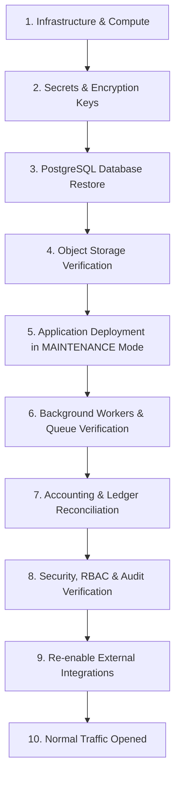

# Disaster Recovery Plan & Business Continuity Framework
**Sai Tours & Travels — AI-Powered Notes, Data & Month-End Accounting Management System**
*Phase 15 Production Architecture Specification*

---

## 1. System Overview & Architecture
The system is an enterprise accounting, smart notes, and document vault platform built for Sai Tours & Travels. It manages double-entry financial transactions, customer and supplier ledgers, month-end closing locks with immutable snapshots, and confidential customer documents.

- **Application Engine:** Next.js (App Router, Server Actions, Node.js runtime).
- **Primary Database:** PostgreSQL 16 (Managed instance with connection pooling).
- **Object Storage:** AWS S3 (AES-256-GCM / AWS-KMS client-side and server-side encryption) with versioning enabled.
- **Audit Subsystem:** Append-only cryptographic SHA-256 hash-chained event log.
- **Disaster Recovery Targets:**
  - **Recovery Point Objective (RPO):** **1 Hour** (Daily full snapshots + continuous WAL archiving).
  - **Recovery Time Objective (RTO):** **< 30 Minutes** (Measured test restore and reconciliation execution).

---

## 2. Backup Architecture & Storage Domains

The system enforces strict separation between **Backup Created** and **Backup Verified**. A backup is never considered reliable until it has passed an automated test restore and accounting reconciliation.

| Backup Domain | Target Data | Format | Schedule | Storage Location | Protection Policy |
| :--- | :--- | :--- | :--- | :--- | :--- |
| **PostgreSQL Database** | Full schema, tables, ledgers, audit logs, closing snapshots | pg_dump Custom/Tar + WAL streams | Daily 02:00 IST + Continuous WAL | S3 Vault (`backups/{bizId}/db/`) | Retained 30 days. Pre-migration and month-end snapshots marked **PROTECTED** (never purged). |
| **Document Storage** | Invoices, receipts, ticket vouchers, identity documents | Object Storage with Versioning | Real-time object versioning + cross-region replica | S3 Vault (`documents/{bizId}/`) | Object Lock (Governance mode) + S3 Versioning enabled. |
| **Configuration** | Environment variables, business settings, sequences | JSON Manifest with SHA-256 checksum | Captured with every backup | S3 Vault (`backups/{bizId}/config/`) | Strictly redacts secrets; credentials never stored in backups. |
| **Audit Trail** | Append-only audit logs with SHA-256 chain | Cryptographic stream | Real-time append + daily snapshot | Database + S3 replication | Append-only. No deletion or editing permitted. |

---

## 3. Disaster Recovery Orchestration & Recovery Order

When recovering from an outage or catastrophic failure, services must be brought back online in strict chronological order to avoid inconsistent state or premature traffic:

1. **Infrastructure & Network:** Verify virtual network, security groups, and DNS routing.
2. **Secrets & Keys:** Ensure KMS master keys, database passwords, and session secrets are active.
3. **Database Restore:** Restore the latest verified PostgreSQL backup snapshot to recovery instance.
4. **Object Storage:** Validate bucket accessibility and document metadata checksums.
5. **Application Deployment in MAINTENANCE Mode:** Start application with `SYSTEM_MAINTENANCE_MODE=MAINTENANCE`. All public writes are blocked.
6. **Background Workers:** Start background queues with external side effects disabled (`RESTORE_SAFETY_MODE=true`).
7. **Accounting Reconciliation:** Run reconciliation suite:
   - Total Income, Total Expenses, and Net Result reconcile with zero drift.
   - Cash, Bank, and UPI account balances match reference totals.
   - Customer and Supplier subledgers match aggregate receivables and payables.
   - Closed Month-End snapshots have intact SHA-256 integrity hashes.
8. **Security & Audit Check:** Validate user sessions and verify the audit hash chain via `AuditService.verifyIntegrity()`.
9. **External Integrations:** After sign-off, disable safety mode and enable external email, webhooks, and payment gateways.
10. **Traffic Re-opened:** Transition system mode from `MAINTENANCE` to `NORMAL`.

---

## 4. Disaster Failure Scenarios & Standard Operating Procedures (SOP)

### Scenario 1: Production Database Failure / Data Corruption
- **Detection:** Health check endpoint reports DB disconnect or Prisma throws connection/query errors.
- **Procedure:**
  1. Immediately set DNS or load balancer to Maintenance Page.
  2. Provision new PostgreSQL recovery instance or fail over to managed replica.
  3. Locate the latest **VERIFIED** backup in `/settings/backups` or S3 vault.
  4. Restore database dump using `pg_restore --clean --if-exists`.
  5. Run `prisma migrate status` to verify schema compatibility.
  6. Run `RestoreVerificationService.runTestRestore()` to execute accounting reconciliation.
  7. Confirm audit hash chain has zero breaks.
  8. Switch connection string and resume service in `NORMAL` mode.

### Scenario 2: Object Storage Failure / Missing Blobs
- **Detection:** Document download returns 404 or document verification reports missing object key.
- **Procedure:**
  1. Cross-reference `DocumentLink` table storage keys with S3 bucket contents.
  2. Restore missing blobs from S3 Cross-Region Replication or version history.
  3. Validate restored file SHA-256 checksums against the stored checksum in `document_versions`.
  4. Log `DOCUMENT_RESTORED` audit events.

### Scenario 3: Bad Application Deployment
- **Detection:** Next.js runtime crashes, 500 errors, or failed health checks after deployment.
- **Procedure:**
  1. Do NOT rollback the database blindly if new transactions have already occurred.
  2. Roll back the application container to the previous stable release tag.
  3. Verify database compatibility. If a schema migration is incompatible, apply an approved forward-fix migration.

### Scenario 4: Bad Database Migration
- **Procedure:**
  1. Immediately transition system to `READ_ONLY` mode to block writes.
  2. Inspect the failed migration script.
  3. **Rule:** Prefer forward-fix migrations (`ALTER TABLE`, column relaxations) over rolling back database dumps to avoid destroying valid interim transactions.
  4. Restore from backup ONLY if schema corruption destroyed existing table structures.

### Scenario 5: Accidental Record Deletion
- **Principle:** Financial records in this application use **VOID** status rather than hard DELETE.
- **Procedure:**
  1. Check if record was voided via `TransactionStatus.VOID`.
  2. Inspect `audit_logs` for `action = VOID` to determine actor and reason.
  3. If user accidentally entered incorrect data, create an offsetting adjustment transaction rather than performing a database restore.

### Scenario 6: Ransomware / Credential Compromise
- **Procedure:**
  1. **Immediate Revocation:** Revoke all database credentials, S3 IAM credentials, and API keys.
  2. **Session Termination:** Invalidate all active user JWT tokens by rotating `AUTH_SECRET`.
  3. **Isolate Environment:** Cut all external network access.
  4. **Restore Clean State:** Provision clean infrastructure and restore from the latest verified, immutable, write-once backup.
  5. **Integrity Audit:** Run `AuditService.verifyIntegrity()` to verify that historical audit records have not been tampered with.

---

## 5. Credential Rotation Procedures

Credentials must be rotated every 90 days or immediately upon suspected compromise.

| Credential | Rotation Method | Downtime Required | Validation Check |
| :--- | :--- | :--- | :--- |
| **`DATABASE_URL`** | 1. Create secondary DB user with identical grants. 2. Update app `.env` to secondary user. 3. Restart Next.js. 4. Drop primary user. | Zero-downtime | Run `npm test` and test write to records. |
| **`AWS_SECRET_ACCESS_KEY`** | 1. Create second access key in AWS IAM. 2. Deploy new key in environment. 3. Deactivate old key. 4. Delete old key after 24h. | Zero-downtime | Upload and download test document in `/documents`. |
| **`GEMINI_API_KEY`** | 1. Generate new API key in Google AI Studio. 2. Update `GEMINI_API_KEY` in environment. 3. Revoke previous key. | Zero-downtime | Run test query in `/ai`. Accounting remains 100% functional even if AI key is invalid. |
| **`AUTH_SECRET`** | 1. Generate 64-byte random hex string. 2. Update `AUTH_SECRET` in environment. 3. Restart app. Note: Invalidates existing user sessions (users must re-login). | Requires re-login | Login with test account at `/login`. |

---

## 6. Restore Safety Mode Specification
During any test-restore or recovery verification operation, **Restore Safety Mode** (`RESTORE_SAFETY_MODE=true`) must be strictly activated.

When active, the following external operations are blocked server-side:
- **Outbound Email / SMS / WhatsApp Messaging:** All notifications are caught by a mock sink.
- **Payment Gateway Calls:** External payment collection webhooks and refunds are blocked.
- **Production Webhooks:** Outbound webhooks are neutralized.
- **External Paid AI Calls:** AI queries use mocked or cached responses to prevent accidental API billing during test restores.

---

## 7. Disaster Recovery Sign-Off & Verification Checklist

- [ ] Last successful backup completed within 24 hours.
- [ ] Backup verified via automated isolated test restore.
- [ ] Database schema and core tables verified.
- [ ] Accounting ledger reconciles (Income, Expenses, Net Result, Cash, Receivables, Payables).
- [ ] Month-end snapshots verified with SHA-256 hashes.
- [ ] Document links and object checksums verified.
- [ ] Cryptographic SHA-256 audit chain verified with zero broken links.
- [ ] Maintenance mode server-enforcement tested.
- [ ] Disaster recovery credentials rotated and verified.
